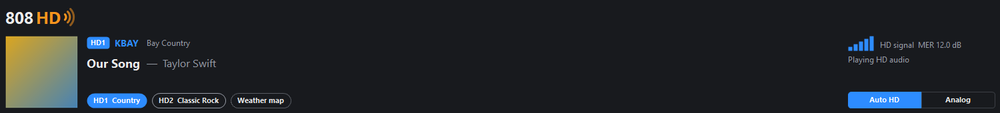
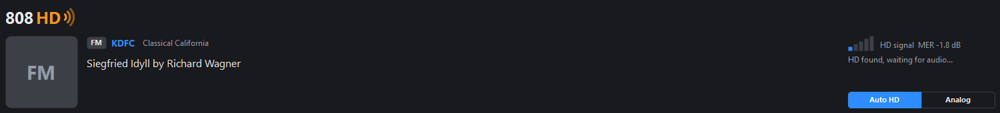
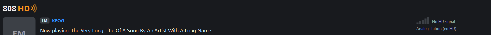

# 808 HD — HD Radio for SDR#

An [SDR#](https://airspy.com/download/) plugin that decodes **HD Radio** (NRSC-5) FM broadcasts
right inside SDR#, using the open-source [nrsc5](https://github.com/theori-io/nrsc5) decoder.
Tune an HD station in WFM and the digital audio, song info and album art just show up,
blended with the analog signal the way a real HD receiver does it.



## Features

- **HD audio inside SDR#.** HD audio replaces the analog audio in SDR#'s own audio chain, so
  SDR#'s volume, mute and output device work as usual. No extra windows or volume sliders.
- **Receiver-style analog/HD blend.**
  - **Time alignment:** the plugin measures how far the HD audio runs ahead of the analog for
    each station (typically 2-3 s) and lines them up, so switching between them doesn't jump.
  - Crossfades to analog *before* a gap in the digital signal (HD audio arrives early, so
    gaps are seen coming), with matched loudness.
  - Weak-signal hysteresis: on a marginal station it stays on analog instead of flapping.
  - **Auto HD / Analog** switch.
- **Now-playing strip** above the spectrum: station name and slogan, title and artist, album art
  or station logo, **HD1–HD8** program buttons, and a signal-quality (MER) meter. On analog-only
  stations it shows SDR#'s RDS text instead.
- **Data services**, where the station sends them: weather and traffic maps, emergency alerts,
  station messages.
- Works with any SDR source SDR# supports at **1 MS/s or more** (RTL-SDR, Airspy, ...). It uses
  SDR#'s own IQ stream, so the dongle isn't shared or reopened.

| Analog, HD signal found | Analog station (RDS) |
|---|---|
|  |  |

## Install

1. Install the **.NET 9 Desktop Runtime** (x64) if you don't have it:
   `winget install Microsoft.DotNet.DesktopRuntime.9`
2. Download `808HD-vX.Y.Z.zip` from [Releases](../../releases).
3. Close SDR#, then unzip so that the `808HD` folder lands in SDR#'s `Plugins` folder:
   ```
   <SDR# folder>\Plugins\808HD\SDRSharp.HDRadio.dll
   <SDR# folder>\Plugins\808HD\libnrsc5.dll
   ```
4. Start SDR# with **`SDRSharp.dotnet9.exe`** (the plugin targets .NET 9).

To remove it, delete `Plugins\808HD`, or rename it to `_808HD` to disable it.

## Use

1. Pick your SDR as the source, with a sample rate of **at least 1 MS/s** (2.4 MS/s works well
   on an RTL-SDR).
2. Select **WFM**, tune an FM station that broadcasts HD Radio, and press **Play**.
3. The **808 HD** strip appears above the spectrum. You hear analog immediately; HD audio takes
   over once decoded and aligned, usually within 10–15 seconds.

Tips:

- The **MER** reading is the digital signal quality. Around 5 dB or more decodes reliably; below
  about 3 dB you'll mostly stay on analog. A better antenna or manual RF gain helps more than anything.
- **HD2/HD3** programs don't carry the analog program, so they can't be time-aligned; if the
  signal drops they fall back to the main analog audio.
- The small **808 HD** side panel (from SDR#'s menu) has the on/off switch and diagnostics:
  signal detail, the measured alignment, and received data files.
- Put your own `logo.png` next to the plugin DLL to replace the 808 HD mark in the strip.

## Build from source

Requirements (all free):

- Windows 10/11 x64, [Git](https://git-scm.com/)
- [.NET 9 SDK](https://dotnet.microsoft.com/download/dotnet/9.0): `winget install Microsoft.DotNet.SDK.9`
- [MSYS2](https://www.msys2.org/) (builds libnrsc5): `winget install MSYS2.MSYS2`
- Airspy's **SDR# SDK for Plugin Developers** from https://airspy.com/download. Its license doesn't
  allow redistribution, so it isn't in this repository; you only need it to compile.

```powershell
git clone --recursive https://github.com/<you>/<repo>.git
cd <repo>
# unzip the SDR# plugin SDK so that sdk\sdrplugins\lib\SDRSharp.Common.dll exists
.\build.ps1
```

`build.ps1` builds `libnrsc5.dll` from the `nrsc5` submodule with MSYS2 (the first run installs
the MSYS2 toolchain packages and takes a few minutes), builds the plugin, and writes
`dist\808HD-v<version>.zip`. Options:

- `-SdrSharpDir C:\path\to\sdrsharp-x64`: also copy the build into that SDR#'s `Plugins\808HD`.
- `-SdkLibDir <folder>`: SDK reference assemblies somewhere other than `sdk\sdrplugins\lib`.
- `-Clean`: rebuild libnrsc5 from scratch.

### Tests and tools

`tools/` contains offline test harnesses that run nrsc5's sample capture through the same code
the plugin uses. Create the capture first (MSYS2 has `xz`):
`xz -dc nrsc5/support/sample.xz > tools/sample.cu8`

| Tool | What it checks |
|---|---|
| `pipetest` | Channelizer + libnrsc5 decode at native and 2.4 MS/s off-center input |
| `stresstest` | decoder start/stop under load (crash regression); `align` mode: time alignment and blend against the capture's real analog audio |
| `lagtest` | measures how far HD runs ahead of analog in the capture |
| `uirender` | renders the now-playing strip to PNGs without SDR# |
| `offsets.c` | verifies the nrsc5 struct offsets used by the C# bindings |

## How it works

```
SDR# RawIQ hook ──► Channelizer (shift + resample to 744,187.5 S/s) ──► libnrsc5 (pipe mode)
                                                                           │ audio, metadata, images
SDR# PostAF hook ◄── AudioInjector (align, blend, level-match) ◄───────────┘
        │                                              NowPlayingBar (above the spectrum) ◄── status
        ▼
SDR# volume / mute / output
```

- `IQHook` copies SDR#'s raw IQ to a worker thread; `Channelizer` mixes the tuned station to
  0 Hz and resamples it with a windowed-sinc interpolator; `HdDecoder` feeds libnrsc5 and turns
  its events into status, audio and images.
- `AudioInjector` sits on SDR#'s `PostAF` audio hook (before SDR#'s volume). It cross-correlates
  loudness envelopes of the analog and HD audio to find the offset, then plays the HD sample that
  matches the analog timeline, crossfading on gaps.

## Legal

- **License:** GPL-3.0-or-later (it links nrsc5, which is GPLv3). See `LICENSE` and
  `THIRD_PARTY_NOTICES.md`.
- **Not affiliated** with Xperi Inc., iBiquity or Airspy. *HD Radio* is a registered trademark
  of Xperi Inc., used here only to describe the broadcasts this software receives. This is not
  a certified HD Radio product and doesn't use the HD Radio logo.
- HD Radio technology is covered by patents held by Xperi. nrsc5 is an independent,
  reverse-engineered implementation. This project is intended for personal, educational and
  experimental use; you are responsible for complying with the laws that apply to you.
- SDR# and its plugin SDK are Airspy's proprietary software and are not distributed here.

## Credits

- [nrsc5](https://github.com/theori-io/nrsc5) by Theori and contributors — all the actual
  HD Radio decoding.
- FAAD2, FFTW, librtlsdr, libusb and libao (via nrsc5).
- [SDR#](https://airspy.com/) by Airspy.
